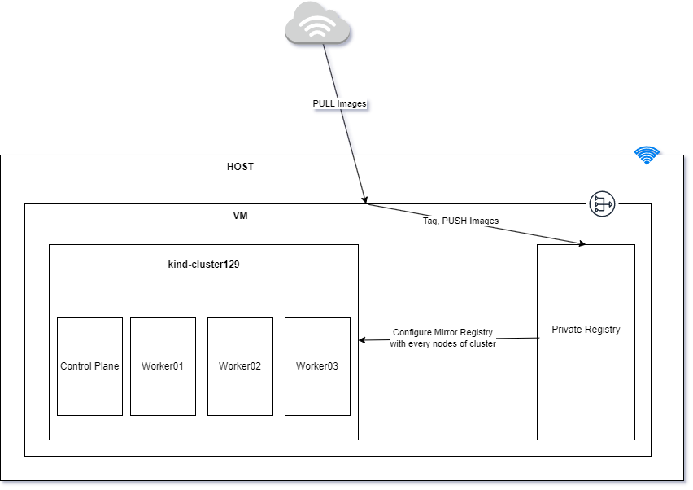

# offline-kind-cluster-with-calico-CNI
This repo contains scripts and resources to deploy a Kind cluster (1 master, 3 workers) using Calico CNI in an air-gapped environment.


## Prepare Registry in local (VM)




```bash
## This repo contains scripts and resources to deploy a Kind cluster (1 master, 3 workers) using Calico CNI in an air-gapped environment.
Key Features:

## Offline installation
1 master node, 3 worker nodes
Calico CNI integration
Air-gap compatible

## Setup:

## Clone this repo
Run prep script to download needed resources
Disconnect from internet
Run main install script

## Requirements:

Docker
Kind
kubectl
```

Create Private Registry with auth

```bash
touch htpasswd
vim htpasswd
cat htpasswd
admin:password
```
```bash
docker run -d -p 5002:5000 --name registry -v /htpasswd:/auth/htpasswd registry:2.7
```

## Prepare Image to pull in local (VM)

- replace own registry
- tag

## fix domain 

```bash
sudo vim /etc/hosts
127.0.0.1 akhlab.com
:wq

## Verify DNS resolution ping test
ping akhlab.com

## Check registry accessibility
curl -v https://akhlab.com:5002/v2/
```

## Need to Install Crane for node and cni images (If you are using window!)

```bash
sudo tar -zxvf go-containerregistry.tar.gz -C /usr/local/bin/ crane

crane cp --insecure calico/node-windows:v3.27.2 knt.com:5002/calico/node-windows:v3.27.2
crane cp --insecure calico/cni-windows:v3.27.2 knt.com:5002/calico/cni-windows:v3.27.2
```

## After pull images in your local, confirm images in own repositories 

```bash
docker ps
docker images
curl -X GET  http://akhlab.com:5002/v2/_catalog

{"repositories":["calico/apiserver","calico/cni","calico/csi","calico/ctl","calico/dikastes","calico/kube-controllers","calico/node","calico/node-driver-registrar","calico/pod2daemon-flexvol","calico/typha","tigera/operator"]}
```

## Enable access private registry to pull from the Cluster

- optino1
By using registry mirroring (private registry to cluster nod)
Configure containerd config.toml on every nodes of cluster.
Here is a single command, It can be done for all nodes.

## By using kind load, you can load your docker image on evey nodes into the cluster.
- kind load

## After kind load, you can confirm local images on your nodes by using crictl images

```bash
docker exec -it 123-worker sh
```
- Output

```bash
vagrant@cloud-native-box:~/offline-kind-cluster-with-calico-CNI$ docker exec -it 123-worker sh
# crictl images
IMAGE                                          TAG                  IMAGE ID            SIZE
akhlab.com:5002/calico/apiserver               v3.27.2              5d4a0194d5324       94MB
akhlab.com:5002/calico/cni                     v3.27.2              bbf4b051c5078       195MB
akhlab.com:5002/calico/csi                     v3.27.2              b2c0fe47b0708       17.4MB
akhlab.com:5002/calico/ctl                     v3.27.2              c7897faecd0db       64.2MB
akhlab.com:5002/calico/dikastes                v3.27.2              236c3ef9745d9       40.5MB
akhlab.com:5002/calico/kube-controllers        v3.27.2              849ce09815546       75.6MB
akhlab.com:5002/calico/node-driver-registrar   v3.27.2              73ddb59b21918       22.6MB
akhlab.com:5002/calico/node                    v3.27.2              50df0b2eb8ffe       346MB
akhlab.com:5002/calico/pod2daemon-flexvol      v3.27.2              ea79f2d96a361       15.4MB
akhlab.com:5002/calico/typha                   v3.27.2              2ec97bc370c17       68.4MB
akhlab.com:5002/tigera/operator                v1.32.5              ad0ff4e31a03b       69.5MB
docker.io/kindest/kindnetd                     v20230511-dc714da8   b0b1fa0f58c6e       27.7MB
docker.io/kindest/local-path-helper            v20230510-486859a6   be300acfc8622       3.05MB
docker.io/kindest/local-path-provisioner       v20230511-dc714da8   ce18e076e9d4b       19.4MB
k8s.gcr.io/kube-apiserver                      v1.23.17             237fa81e1d0b6       77.4MB
registry.k8s.io/kube-apiserver                 v1.23.17             237fa81e1d0b6       77.4MB
k8s.gcr.io/kube-controller-manager             v1.23.17             ac60f848fba76       66.1MB
registry.k8s.io/kube-controller-manager        v1.23.17             ac60f848fba76       66.1MB
k8s.gcr.io/kube-proxy                          v1.23.17             d3e1fbfbdbee1       113MB
registry.k8s.io/kube-proxy                     v1.23.17             d3e1fbfbdbee1       113MB
k8s.gcr.io/kube-scheduler                      v1.23.17             30ade481bcbe9       53.2MB
registry.k8s.io/kube-scheduler                 v1.23.17             30ade481bcbe9       53.2MB
quay.io/metallb/controller                     v0.13.9              26952499c3023       27.8MB
quay.io/metallb/speaker                        v0.13.9              697605b359357       50.1MB
registry.k8s.io/coredns/coredns                v1.8.6               a4ca41631cc7a       13.6MB
registry.k8s.io/etcd                           3.5.6-0              fce326961ae2d       103MB
registry.k8s.io/pause                          3.7                  221177c6082a8       311kB
```

## Confirm existing credentials for private registry in local (VM)

```
vagrant@cloud-native-box:~/offline-kind-cluster-with-calico-CNI$ cat ~/.docker/config.json ##  it is auto-generated when you first time login registry
{
        "auths": {
                "669745465514.dkr.ecr.ap-southeast-1.amazonaws.com": {
                        "auth": "QVdTOmV5SndZWGxzYjJGa0lqb2llVzFKYlc4d2QwOHJNek5xY1hKVGVGazJXa3BxTVcxM2VYUjVWVFo0T0VGVmFFRlRUalE0YldzMllYVlNSSHA0TUcxbFdIWkZTRmx5WTBGQlVVRnNTbUpMUjA5Vk1GUXJkMUo0TkUxRldqQTNWSEJLUW0xMk4zUlNaWHBwVFZST2MzQnhjekZrU1hwbVZqUXpZaXN3TDFCTVlVVjRlbmRxZVdVemJuUTJNSHBGUTBKME5FMW1OWGRpWkhoWlpVTkJVMWRhVEU5cGJEZFJiM0F2YmtGeVYzWlBlbGxEU3pCeE1tOUhVRzB5VmpsWVNVcEJUMUZ4WW1adVYydzNWV1JuVTJsdWQyMHlVelUzZUVGSFNVWmlSalpoTUhSclFucFdTV2t3VFZwaVNtWnBaMmc0YkVWVk0yeE5hMUZSTXpSR1RUVmlkWFJOYUVOb1Z6UjZRVmhuTlZoeGFHOUZaREZxWTJwMU16Qk1TV0Z0YVd4RVJWZzVaWGR1VlV4UmJUSm5VelZJWlV4RFlXbGtTQzl2VWs1b2VscFdkVzFsWXk5d09YSjJja3hEUkVadWR6UnhXSEpxT0ZsWE5TOVdORVZPTW1kUWJVWkJlakV4WmpWNVNtVlVRV2c0YkcxV1JuVlZVRXRtTnpOeFNUaFBWMFZxYmxOVlkxcFdlbmRsUzFKNWFHTk9NMDlsYVRkcWVrTTNWSGxrY0ZkbWVsWmxVMnRrTTFscWIweEViMGgzU0daTWRVTlpSMk5aYlRsaU4zVXdNMHB3ZHpKRFNXeHBWWFV6WWtSNFYxcDBibGczVVcxSk5GRlpibXRYUzA1TWMxUkdTRXA0YVZsUlpteE1ZMkZKUW5Kc2JXRXlWMkpQU2poeU5sRjViSEJWYlM4dlFsWkpiazh2YW5oUFdtcHZabWRyYjFSRmRFNDRZV2RYVWtkaWRWTnNVbVI2V2tsTU5GSlRZamsxZEVZNGMwc3haVWRGYlRKSk5HdFFVVTlET0U5SFFXbzVja0pxVHpSS2FtRmpielJQZUVsa2JIcDJZVEpOYkRGWVF6TlZjbkIzTURBNVZreFBObVpUY1dsQ2FGaHlWQ3RwVWtoRFRsWjRORlJ6YVhKYU5GTmliMVZ4V2xKRmIydEZaWGszYjBZdlptVktVakp6YldkWGJraDNXVFpLYkRsUGVtZHBTWE5NYmxSS1JpOVBLMGg1THk5WlUySkplWFI0Y1N0RlZGQkZXalpxTm5Vd1ZubHhja1V3YjFWRFFXVllUVTFDTVhFek1tWlVaRk5RV25oalNFNXhlbFk0TTIxeVIwTjRUWGhoVGtOdk1HRjJlbVY0TDNKc1ExTmtTRGxXVEdSUGNIUkRTV0Z1Um5WRmFIbHNTbFJ2VEVORlFUQkxjMXBCZDBONE5ETkJSSFIwYkhkVGFGbDRObEYyTWtKTWRHOUplVXNyVEd0clYzTmFVR0pqWlRsc1lVWnRLMDVUUjFncllVSkliSEp1WkV4V2NHUjZOemRyWkhWdGJWSnZaMHhVTURKQ2MyRllkRlZhU0c5Q0wxSmhaVEIxTDAxT1YxbGtia2MxYWxrME5UZFNSbXBLYmt4RVYzWmFSblFyUmtkbVpUQjVaWE42U0ZNMVMydEZlVEpzYm5WcWNHRjFjQzgzUzJwMVVGaGFlVlJHUlZRMmVHRTNTVUpRVUhaQ01qSjVXRXhrV21Kc1NuaFRUV2ROSzFFMlZXNXdVRFJPUkZaU2MwdExObmRMVWtZcmNsVjViRTlQTm1kQ09EWTFiVEZHZVZSSFdGbEhaVW93WlVOTFYxaHNSRlZFV2pWRlRYZDBWV2hGV0VWa2FWbERkblZ2TkZaNGEyUnhVMmxWY1dodmRXSmFVak5aTHpkQlZtZzNVVDBpTENKa1lYUmhhMlY1SWpvaVFWRkZRa0ZJYVdSRmNscERabWhMVDJWRVRUQTRLMk5RTldaMGVXcDJVVGxZVFUxVFVUUndTekJHV201MlFWcFlTbWRCUVVGSU5IZG1RVmxLUzI5YVNXaDJZMDVCVVdOSGIwYzRkMkpSU1VKQlJFSnZRbWRyY1docmFVYzVkekJDUW5kRmQwaG5XVXBaU1ZwSlFWZFZSRUpCUlhWTlFrVkZSRTB4U1VsNkx6TTJhemh6UVVsTVMwRlJTVUpGU1VFM1RXOWhaMVExTTBGNWVrRkxXVlZPTm10UWJrZ3JieTl4YkVObWJWZEdNRnAwWkdFelJHWXpjU3NyUTBzdlVsZGFjMXBEY21SVFl6bHlhRk14TldscmNGWklValJuUW5ZclIwOXpTbE16V1QwaUxDSjJaWEp6YVc5dUlqb2lNaUlzSW5SNWNHVWlPaUpFUVZSQlgwdEZXU0lzSW1WNGNHbHlZWFJwYjI0aU9qRTNNVFkyTlRrd016Rjk="
                },
                "https://index.docker.io/v1/": {
                        "auth": "YWtobGFiOlQwMHItMjA0OA=="
                }
        }
}vagrant@cloud-native-box:~/offline-kind-cluster-with-calico-CNI$ 
```

**Ref:**

https://kubernetes.io/docs/tasks/configure-pod-container/pull-image-private-registry/

https://docs.tigera.io/calico/latest/operations/image-options/alternate-registry